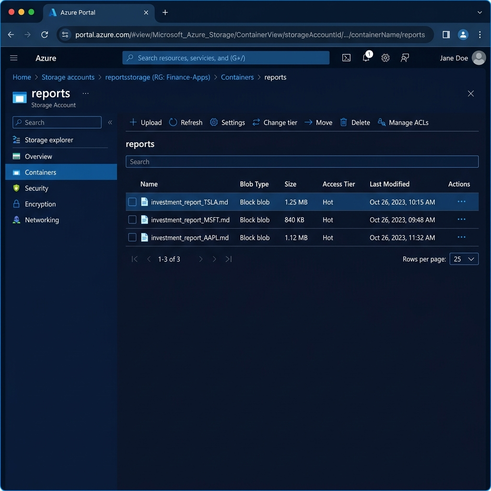
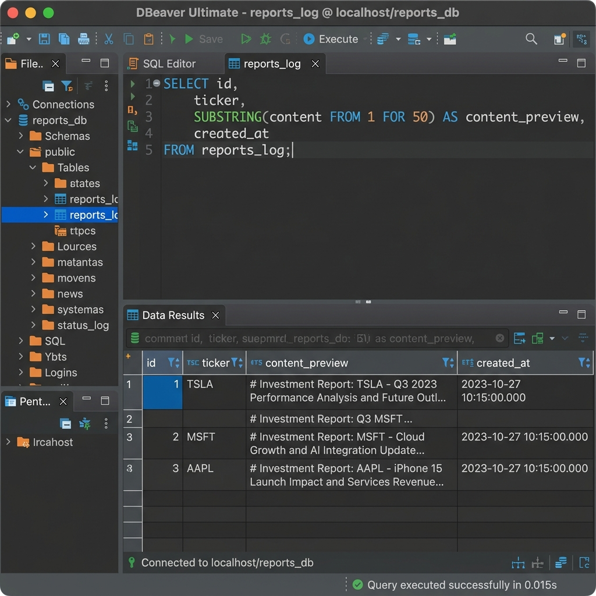
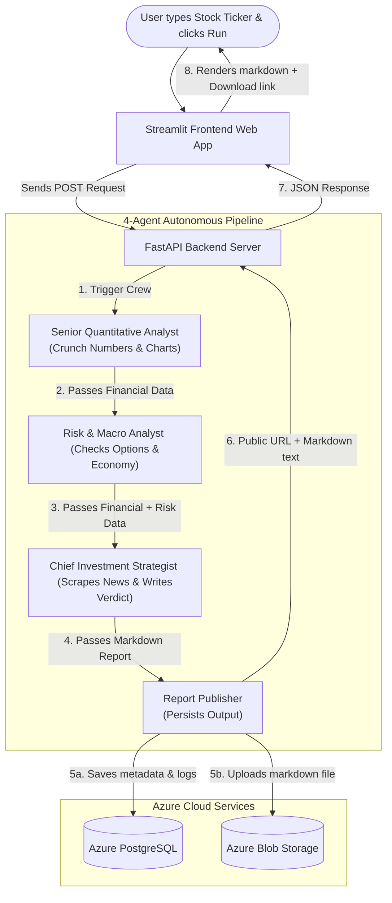

# 💸 AI Multi-Agent Financial Analyst

[](https://www.python.org/)
[](https://www.crewai.com/)
[](https://fastapi.tiangolo.com/)
[](https://streamlit.io/)
[](https://azure.microsoft.com/)
[](https://azure.microsoft.com/)
[](https://www.langchain.com/langsmith)

Get a **professional, Wall Street-grade investment analysis report in under 3 minutes** — powered by an autonomous, collaborative 4-Agent AI Team. Type in any stock symbol (US or Indian stock), click a button, and watch your digital research department go to work.

---

## 🖥️ Interactive Streamlit Web UI Tour

Below is a live video demonstration showing the complete walkthrough of the Streamlit application in action (entering the stock ticker, running the AI Crew analysis, checking progress, scrolling the generated report, and inspecting database/storage logs):


*Note: If your markdown viewer does not render the WebP video animation, you can open the file [financial_agent_demo.webp](assets/financial_agent_demo.webp) directly in any standard web browser.*

### 🎨 Web App Layout Mockup:

```text
┌────────────────────────────────────────────────────────────────────────┐
│  🤖 AI Agent Financial Analyst                        [ localhost:8501 ] │
├──────────────────────────────┬─────────────────────────────────────────┤
│  ⚙️ Control Panel            │  Welcome! This tool leverages a         │
│                              │  multi-agent AI team...                 │
│  Enter Stock Ticker Symbol   │                                         │
│  [ TCS.NS             ]      │  ┌───────────────────────────────────┐  │
│                              │  │ 📄 Final Report  │  🔍 Meta Logs   │  │
│  [ 🚀 Run Full Analysis   ]  │  ├───────────────────────────────────┤  │
│                              │  │ # Investment Report: TCS          │  │
│  ──────────────────────────  │  │ ## Executive Summary              │  │
│  💡 Note: Takes 1-3 minutes. │  │ TCS displays strong fundamentals  │  │
│                              │  │ with a clear BUY verdict...       │  │
│                              │  │                                   │  │
│                              │  │ [ 📥 Download Report (Markdown) ] │  │
│                              │  └───────────────────────────────────┘  │
└──────────────────────────────┴─────────────────────────────────────────┘
```

### ✨ Web App Interactive Features:

1. **⚙️ Control Panel (Sidebar):**
   * **Stock Ticker Input:** Type in any stock symbol (e.g., `NVDA` for Nvidia, `TCS.NS` for Tata Consultancy Services).
   * **🚀 Run Full Analysis Button:** Triggers the sequential 4-agent background research pipeline.
2. **🧠 Real-Time Progress Spinner:**
   * Shows visual loading cues while the AI agents gather live numbers, news, risks, and economic data.
3. **📄 Tab 1: Final Investment Report (Formatted Markdown):**
   * View the complete, beautifully formatted research note with headers, bullets, and tabular snapshots directly in your browser.
   * **📥 Download Button:** Instantly download the complete report as a standard markdown file (`investment_report_<TICKER>.md`) to your system.
4. **🔍 Tab 2: Metadata & Cloud Logs:**
   * **Azure Blob Storage Link:** Clickable, permanent URL to view or share the raw report saved in the cloud storage container.
   * **Database Save Confirmation:** Real-time feedback on whether the report has been successfully persisted to your database.
   * **Raw JSON Dropdown:** Expandable section displaying the exact server response payload.

### ☁️ Azure Cloud Storage & Database Verification:

To verify that the multi-agent system successfully persists every generated investment report to the cloud, you can view the storage records and database tables in your Azure Portal and SQL clients:

<details>
<summary><b>📦 View Azure Blob Storage Screenshot</b></summary>
<br>

Here is the Azure Portal view showing the `reports` Blob Storage container populated with the uploaded Markdown files:



</details>

<details>
<summary><b>🗄️ View Azure PostgreSQL Database Query Screenshot</b></summary>
<br>

Here is the database manager view executing a query on the `reports_log` table, showing the stored metadata, ticker names, and generated markdown reports:



</details>

---

## 🎯 What Is This Project? (The Plain-English Analogy)

Imagine you wanted to invest your savings in a stock like **Apple (`AAPL`)** or **Tata Motors (`TATAMOTORS.NS`)**, but you don't have the time to read hundreds of financial statements, analyst reviews, news articles, and economic reports.

Normally, you would have to hire a Wall Street investment firm. In that firm, your request would go to a **research department** consisting of:
1. **The Numbers Nerd (Quantitative Analyst):** Crunches balance sheets, stock charts, and financial math.
2. **The Risk Manager (Risk & Macro Analyst):** Checks if inflation, interest rates, or options market bets pose a danger.
3. **The Director (Chief Investment Strategist):** Combines the math with recent news headlines to make the final **BUY, SELL, or HOLD** recommendation.
4. **The Archivist (Data Engineer/Publisher):** Files the report safely in the vault (cloud database) so it's never lost.

**This application is that entire investment firm — fully automated with Artificial Intelligence.** 

Instead of paying thousands of dollars and waiting days, **CrewAI** coordinates four specialized AI agents to work sequentially. Within 3 minutes, they build, verify, write, and save a professional investment report for you.

---

## 🚀 How It Works (Visual Architectural Flow)

Here is a high-level view of how data flows through the application when you click **Run Full Analysis**:



---

## 👥 Meet Your 4-Agent Research Team

Each of the four agents is configured with a specific **backstory**, a **goal**, and a set of **custom tools** to fetch real-world data. Here is what they do in plain English:

### 1. 📊 The Quantitative Analyst ("The Math Brain")
* **Goal:** Crunch the financial numbers and assess if the stock is mathematically cheap, expensive, or trending upwards.
* **What it checks and what it means in plain English:**
  
  | Metrics Evaluated | Meaning in Plain English |
  | :--- | :--- |
  | **P/E & PEG Ratios** | Is the stock cheap or expensive relative to its current and future earnings? |
  | **RSI & MACD (Technicals)** | Is the stock overbought (due for a drop) or oversold (good time to buy)? |
  | **Earnings History** | Has the company historically beaten or missed Wall Street's expectations? |
  | **Discounted Cash Flow (DCF)** | What is the stock's actual intrinsic worth based on projected future cash flows? |
  | **Performance vs S&P 500** | Is this stock outperforming or lagging the rest of the market? |

---

### 2. ⚖️ The Risk & Macro Analyst ("The Context Brain")
* **Goal:** Look at the bigger picture. Even if a stock's numbers are great, does the state of the world make it a dangerous investment?
* **What it checks and what it means in plain English:**
  
  | Metrics Evaluated | Meaning in Plain English |
  | :--- | :--- |
  | **Options Put/Call Ratio** | Are professional traders placing massive bets that the stock will fall? |
  | **Implied Volatility (IV)** | How violent are the price swings expected to be? |
  | **Macroeconomic Backdrop** | How do Central Bank interest rates, CPI Inflation, and GDP growth affect this sector? |
  | **Sector Benchmarking** | Is the entire industry doing well, or is this company trying to swim upstream? |

---

### 3. 🎯 The Chief Investment Strategist ("The Decider")
* **Goal:** Read the latest news, search analyst ratings, connect all the data dots, and issue the final **BUY, SELL, or HOLD** recommendation.
* **What it checks and what it means in plain English:**
  
  | Metrics Evaluated | Meaning in Plain English |
  | :--- | :--- |
  | **News Sentiment Search** | Scrapes the last 10 headlines across the web. Is the public mood bullish or bearish? |
  | **Catalyst Tracking** | Identifies events like new product launches, lawsuits, leadership changes, or earnings releases. |
  | **Consensus Synthesis** | Reads what major banks (Goldman Sachs, Morgan Stanley) are advising. |
  | **Report Composition** | Writes a beautiful, detailed, structured Markdown investment report explaining the thesis. |

---

### 4. ☁️ The Report Publisher ("The Archivist")
* **Goal:** Ensure the report is durably saved in the cloud.
* **What it checks and what it means in plain English:**
  
  | Action Taken | Meaning in Plain English |
  | :--- | :--- |
  | **PostgreSQL Record** | Logs the ticker symbol and the exact time of research into a central database. |
  | **Blob Storage Archival** | Uploads the full markdown file to the cloud and returns a permanent public link. |

---

## 🇮🇳 Support for Indian Stocks (NSE & BSE)

The application includes robust, native support for Indian stock markets without requiring any additional API keys or subscription setups. It handles all NSE and BSE tickers automatically!

### 📌 How to enter Indian tickers:
* **NSE (National Stock Exchange):** Add `.NS` to the symbol (e.g., `TCS.NS`, `RELIANCE.NS`, `INFY.NS`, `HDFCBANK.NS`).
* **BSE (Bombay Stock Exchange):** Add `.BO` to the symbol (e.g., `TCS.BO`, `RELIANCE.BO`).

### 🛠️ What happens automatically under the hood for Indian stocks:
* **Market Benchmarking:** Compares the stock's performance against the **Nifty 50 Index (`^NSEI`)** instead of the S&P 500 (`SPY`).
* **Sector Analysis:** Automatically maps the stock to its corresponding NSE Sectoral Index (e.g., `^CNXIT` for Tech, `^NSEBANK` for Finance, `^CNXAUTO` for Automobiles).
* **Macroeconomics:** Fetches **India CPI (Inflation)**, **GDP growth**, and **USD/INR exchange rate** from FRED and Yahoo Finance rather than US Federal Reserve data.

---

## 🛠️ Foolproof Setup & Installation Guide

This project is built using modern Python development standards, leveraging the ultra-fast Python package manager **`uv`**. Follow these steps to set up the system on your machine:

### 1️⃣ Prerequisites
Make sure you have **`uv`** installed. If you don't, install it using one of these commands:
* **macOS / Linux:**
  ```bash
  curl -LsSf https://astral.sh/uv/install.sh | sh
  ```
* **Windows (PowerShell):**
  ```powershell
  powershell -c "irm https://astral.sh/uv/install.ps1 | iex"
  ```

---

### 2️⃣ Clone the Repository & Install Dependencies
1. Navigate to the project directory:
   ```bash
   cd financial-multi-agent-system
   ```
2. Let **`uv`** handle environment creation and install all dependencies automatically from [pyproject.toml](file:///Users/sindhuram/Downloads/financial-multi-agent-system/pyproject.toml):
   ```bash
   uv sync
   ```

---

### 3️⃣ Configure Environment Variables
1. Duplicate the template environment file:
   ```bash
   cp .env.example .env
   ```
2. Open the newly created [`.env`](file:///Users/sindhuram/Downloads/financial-multi-agent-system/.env) file and fill in your credentials. Refer to the table below for guidance on how to get each key:

| Variable | Required | Description | Where to Get It |
| :--- | :---: | :--- | :--- |
| `OPENAI_API_KEY` | **Yes** | Powers the core LLM reasoning. | [OpenAI API Keys](https://platform.openai.com/api-keys) |
| `FIRECRAWL_API_KEY` | **Yes** | Performs live web searches and crawls news. | [Firecrawl Dashboard](https://www.firecrawl.dev/) |
| `FRED_API_KEY` | **Yes** | Fetches live economic indices (CPI, Interest Rates). | [FRED API Key (FREE)](https://fred.stlouisfed.org/api/keys.html) |
| `AZURE_POSTGRES_CONNECTION_STRING` | No | Saves records to a central PostgreSQL database. | Azure Portal (PostgreSQL database connection string) |
| `AZURE_BLOB_STORAGE_CONNECTION_STRING` | No | Saves final reports as cloud-hosted markdown files. | Azure Portal (Storage Account access key string) |
| `LANGSMITH_API_KEY` | No | Enables full agent tracing, logging, and inspection. | [LangSmith Dashboard](https://smith.langchain.com/) |

> [!TIP]
> **No Cloud? No Problem!**
> If you do not configure Azure PostgreSQL or Azure Blob Storage connection strings, the application will simply skip these steps and write the generated report locally to a markdown file (`investment_report_<TICKER>.md`) without throwing any crashes or errors.

---

## ⚡ Running the Application

To run the complete system, you need **two terminal windows** open side-by-side:

### Terminal 1: Start the FastAPI Backend (The "Brain")
This starts the local FastAPI server that manages the agent execution.
```bash
uv run uvicorn src.api.main:app --reload
```
*Wait until you see the message: `Application startup complete` and `Uvicorn running on http://127.0.0.1:8000`.*

### Terminal 2: Start the Streamlit Frontend (The "Face")
Open a new terminal window, navigate to the project directory, and start the interactive web application:
```bash
uv run streamlit run frontend/app.py
```
Streamlit will automatically open your default browser to:
👉 **`http://localhost:8501`**

Now, simply enter a ticker (like `NVDA` or `TCS.NS`) in the sidebar, click **🚀 Run Full Analysis**, and watch the agents collaborate in real-time!

---

## 📁 Interactive Features & Technical Highlights

Click the sections below to expand advanced implementation details and technical configurations:

<details>
<summary><b>🔌 Developer API Endpoint Reference</b></summary>
<br>

The FastAPI server provides several endpoints that can be integrated into external systems.

### 1. Health Check
* **Route:** `GET /`
* **Purpose:** Verifies backend status and supported configurations.
* **Sample Response:**
  ```json
  {
    "status": "healthy",
    "service": "AI Financial Analyst (4-Agent Crew)",
    "version": "2.0.0",
    "agents": [
      "Senior Quantitative Analyst",
      "Risk & Macro Analyst",
      "Chief Investment Strategist",
      "Report Publisher"
    ],
    "markets_supported": ["US", "India (NSE/BSE)"],
    "docs": "/docs"
  }
  ```

### 2. Run Financial Analysis
* **Route:** `POST /api/v1/analyze`
* **Payload Structure:**
  ```json
  {
    "ticker": "MSFT"
  }
  ```
* **Success Response (200 OK):**
  ```json
  {
    "status": "success",
    "ticker": "MSFT",
    "market": "US",
    "report_content": "# Investment Report: MSFT...",
    "report_url": "https://crewquantagent2023.blob.core.windows.net/reports/investment_report_MSFT.md",
    "db_saved": true,
    "message": "Analysis complete for MSFT (US).",
    "generated_at": "2026-05-18T00:54:29Z"
  }
  ```

### 3. List Past Database Reports
* **Route:** `GET /api/v1/reports?limit=20`
* **Purpose:** Queries Azure PostgreSQL for past analyses.
* **Success Response:**
  ```json
  {
    "reports": [
      {
        "id": 1,
        "ticker": "NVDA",
        "created_at": "2026-05-17T12:00:00Z"
      }
    ],
    "total": 1
  }
  ```

### 4. Fetch Specific Report Content
* **Route:** `GET /api/v1/reports/{report_id}`
* **Purpose:** Retrieves a detailed markdown report body by its database ID.
</details>

<details>
<summary><b>🗄️ Azure PostgreSQL Database Schema</b></summary>
<br>

When a report completes, the **Report Publisher** records it into a PostgreSQL table.
* **Table Name:** `reports_log`
* **Columns Structure:**

| Column Name | SQL Data Type | Attributes | Purpose |
| :--- | :--- | :--- | :--- |
| `id` | `INTEGER` | Primary Key, Auto-increment | Unique identifier for each log record. |
| `ticker` | `VARCHAR(10)` | Not Null | Ticker symbol analyzed (e.g. `AAPL`). |
| `content` | `TEXT` | Not Null | The full, generated Markdown report text. |
| `created_at` | `TIMESTAMP` | Default: UTC Now | When the analysis was generated. |

</details>

<details>
<summary><b>📂 Repository Directory Map</b></summary>
<br>

Here is the structural layout of this codebase:
```text
financial-multi-agent-system/
├── frontend/
│   ├── app.py                # Streamlit Web Application Interface
│   └── requirements.txt      # Frontend package requirements
├── src/
│   ├── agents/
│   │   ├── tools/
│   │   │   ├── financial.py  # Fundamental, Technical, DCF, FRED indicators
│   │   │   ├── publisher.py  # Save to SQL / Upload to Blob Storage
│   │   │   ├── scraper.py    # Firecrawl-based web scraping tools
│   │   │   └── search.py     # Custom search utilities
│   │   ├── agents.py         # CrewAI Agent definitions and personas
│   │   ├── tasks.py          # CrewAI Task definitions and prompt chains
│   │   └── crew.py           # Crew setup, process orchestrator (Sequential)
│   ├── api/
│   │   ├── main.py           # FastAPI entrypoint, middleware, health-check
│   │   ├── models.py         # Pydantic data schemas for requests/responses
│   │   └── routes.py         # REST endpoint logic (analyze, database queries)
│   └── shared/
│       ├── config.py         # Pydantic Settings management (env configs)
│       ├── database.py       # SQLAlchemy Azure PostgreSQL service
│       ├── storage.py        # Azure Blob Storage upload service
│       └── telemetry.py      # OpenTelemetry and observability config
├── .env.example              # Template configuration variables
├── Dockerfile                # Deployment container configuration
├── main.py                   # Production CLI entry point (terminal only)
├── pyproject.toml            # Project dependencies & Python 3.13 spec
└── README.md                 # Project handbook (this file!)
```
</details>

---

## 📈 Example Investment Report Format

When you run an analysis, the strategists format the output into a professional, publication-ready research note containing:
1. **Executive Summary:** A high-level overview of the findings and the direct conclusion.
2. **Quantitative Snapshot:** A summary table containing key metrics (P/E, Market Cap, DCF Valuations).
3. **Technical Analysis Summary:** Trend evaluation (Bullish/Bearish) with specific indicators (RSI, MACD, Bollinger Bands).
4. **Risk & Macro Assessment:** High/Medium/Low rating based on the interest rate environment, inflation, and options PCR.
5. **News & Market Sentiment:** The top 3 positive or negative market news catalysts.
6. **Valuation Assessment (DCF):** An estimated intrinsic value vs. the current trading price.
7. **Final Verdict:** Clear recommendation: **BUY**, **SELL**, or **HOLD**.
8. **Investment Thesis:** A 2-to-3 paragraph detailed argument supporting the recommendation.
9. **Key Risks to Watch:** Key assumptions or events that could invalidate the thesis.

---

## 🛡️ Financial Disclaimer

This software is an educational and research demonstration tool. It does **not** constitute financial advice, investment recommendations, or legal solicitations. Always perform your own comprehensive research or consult a licensed professional financial advisor before executing trades or making real-world financial investments.
